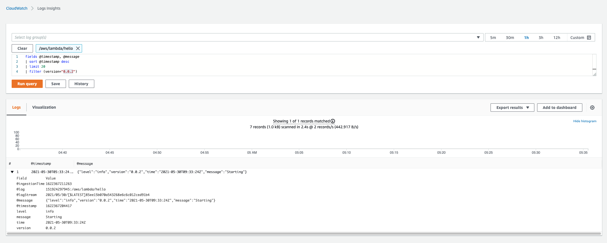

This project implements this aws lambda hello world example  https://docs.aws.amazon.com/lambda/latest/dg/golang-handler.html

The purpose is to make a simple template that includes some terraform to deploy the lambda. The ssample lambda should:
 - accept request event
 - return a response event (to be used by step functions)
 - output structured logs to cloudwatch

## Deployment

1) Copy deployments/example.settings.tfvars deployments/settings.tfvars
2) Edit deployments/settings.tfvars with correct values
3) Deploy the lambda
```bash
# compile the binary and create the lambda zip
make compile
# run terraform
make tfplan
make tfapply
# invoke the lambda, usingrequest.json as the input
make invoke
# review the response
cat out.json
```

The lambda uses zerolog to emit structured log data. This includes a version field. The structured JSON logs are automatically parsed by cloudwatch, so you can filter on the field.  In the exsmple below, we use the default insights query and add the filter to find logs generated with the version tag.  These queries can also be used to generate cloudwatch metrics and alarms. I have a different monitor project that does metrics and alarms(https://github.com/natemarks/lambda-dns-lookup).

